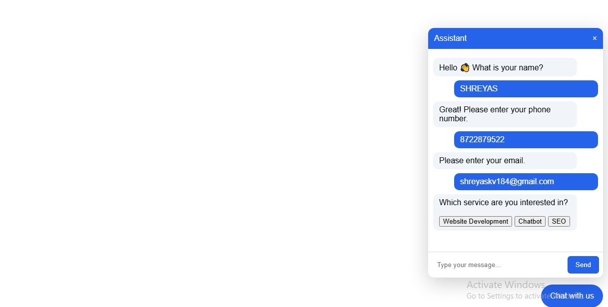
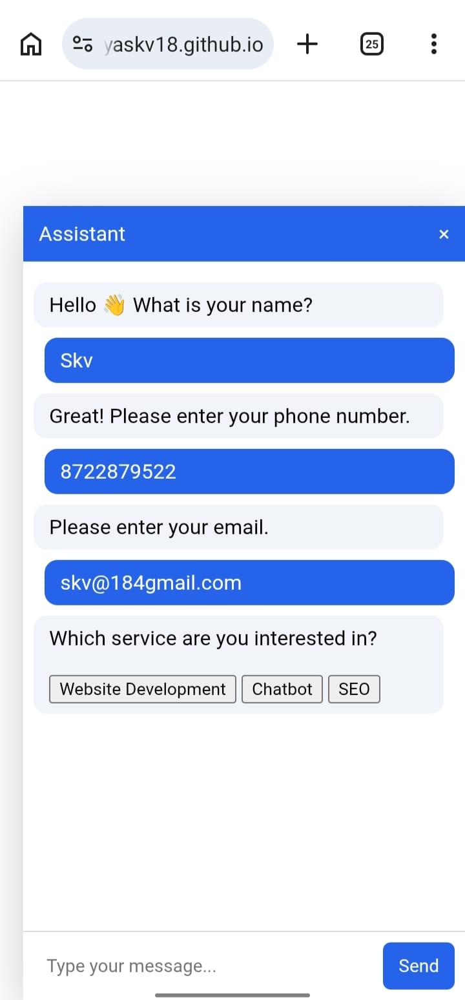
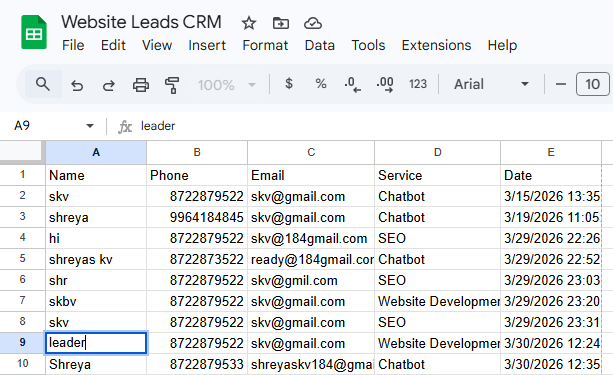

# AI Lead Generation Chatbot

This project is a responsive chatbot built using HTML, CSS, and JavaScript.

Features:
- Collects Name, Phone Number, and Email
- Email and Phone validation
- Typing animation
- Auto scroll
- Service selection buttons
- Google Sheets integration
- WhatsApp lead notification

Technologies Used:
- HTML
- CSS
- JavaScript
- Google Apps Script
- Google Sheets

Live Demo:
(https://shreyaskv18.github.io/ai-chatbot-level-2/)
## Screenshots

### Desktop View

### Mobile View

### Google Sheets Integration

### WhatsApp Lead Notification

Author:
Shreyas K.V
